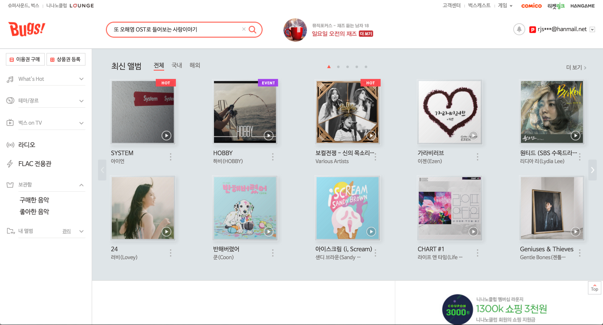

####### Cheetah Group. Activity Log

# 벅스 Bugs

## 논의했던 사항들

### 1. 전체 구조화
벅스의 메인 디자인은 **상단 영역**과 **왼쪽 주 메뉴 부분**이 고정되어 있는 디자인이다. 팀원들마다 첫 페이지의 큰 구조를 짜는 방식이 조금씩 달랐는데, `<header>`에 상단 내용을 , 하단을 `<nav>`와 `<main>`으로 나누는 것과 각 `<header>`와 `<nav>` 그리고 `<main>`영역을 묶는 형태로 구조를 구성했다.

- `<header>`에 상단 내용을 , 하단을 `<nav>`와 `<main>`으로 분리
- `<header>`와 `<nav>` 그리고 `<main>`영역을 
으로 묶는 형태

>HTML에 스타일을 입혀 상단과 주 메뉴를 고정하려 할때, `<nav>`와 `<main>`을 묶어놓은 경우, `<nav>`의 위치 구현이 둘을 감싸는 `.wrap`을 기준으로 하면되어 더 쉬울 것이라는 의견과 불필요한 `
`를 줄이는 차원에서 `<header>`,`<nav>`,`<main>`을 동등하게 두어야 한다는 의견이 있었음.

### 2. 팝업창, 드롭다운 메뉴, 검색창
벅스 사이트에서 제공되는 특정 버튼들은 선택시 박스를 추가로 제공하거나 드롭다운 메뉴를 제공한다. 

>특정 버튼을 클릭했을 때, 적절한 위치에 박스를 띄워주기 위해서는 보여지게 될 박스를 버튼과 같이 묶어주는 것이 좋겠다는 의견이 있었음. 

>내부의 버튼에 따라 전환되는 화면에 대해서는 Ajax 적용을 반영한 구조화
를 조금 더 공부해보자는 의견도 있었음.

>검색어를 입력했을 때 나타나는 원형의 `close`버튼은 `<input type="search">`를 적용했을 때 나타나는 기본형의 버튼이 아니라 커스터마이징한 버튼으로 처리해야 겠다는 의견이 있었음.

### 3. 접근성
웹 사이트에 진입하고 `Tab`키를 누르면 숨어있는 메뉴가 등장한다. 스크린 리더 사용자들이 매번 `<header>`영역의 메뉴를 거치지 않고 본문으로 바로 갈 수 있도록 링크를 제공해주는 용도인데, 구체적인 구현 방법에 대해서 의견을 나누었다.

## 기타 사항들
### 1. HTML 표준 문법
HTML을 구조화하는 과정에서 ul안에 span과 ul을 추가한 팀원이 있어 다른 팀원들이 문제를 제기했다. ul 안에는 li만이 들어올 수 있다는 것을 이론을 통해 학습했지만, 실제 작업과정에서 발생한 실수였다. 문법 검사를 반드시 거쳐서 이러한 실수를 방지하는 방향에 대해 얘기했다.

### 2. <figure> 요소의 활용
벅스 사이트의 대부분을 이루는 이미지와 정보 간의 관계를 <figure>로 처리한 팀원이 있었는데, 왜 이렇게 했는지에 대한 설명이 부족했다. 앞서 탐구했던 몇몇 사이트가 이 요소를 활용하고 있었는데, 활용에 대한 확실한 근거 또는 이유를 가지는 것의 필요성에 대해 이야기 나누었다.

## 리뷰에 대한 앞으로의 방향
#### 코드를 짜면서 각자 어떤 의도를 가지고, 어떤 방식으로 구조화하는 것이 좋을지 고민했던 부분을 중심으로 논의하기로 함.

1. 원본 코드 보지 않고, 코드 작성하면서 고민되는 부분을 정리한다.
2. 원본 코드와 비교 분석한다.
3. 그룹원들끼리 모여서 고민을 나눈다.
4. 해결되지 않는 궁금증은 선생님께 질문하기로 한다.
